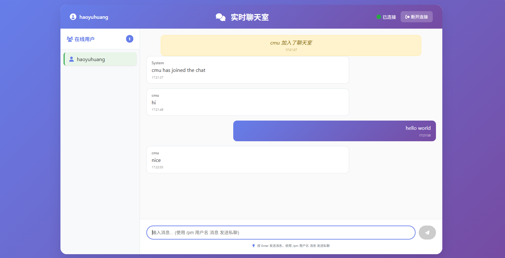

## 快速开始

### 1. 启动 gRPC 聊天服务器
```bash
# build protobuf 文件
protoc --go_out=. --go_opt=paths=source_relative --go-grpc_out=. --go-grpc_opt=paths=source_relative proto/chat/chat.proto
# 构建并启动 gRPC 服务器
go build -o bin/chat-server server/main.go
./bin/chat-server
```

### 2. 启动 Web 服务器
```bash
# 构建并启动 Web 服务器
go build -o bin/web-server main.go
./bin/web-server
```

### 3. 访问 Web 界面
打开浏览器访问：http://localhost:8080





